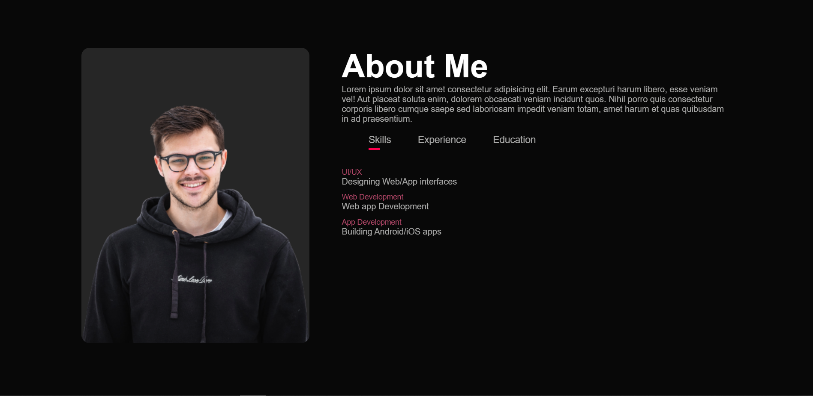
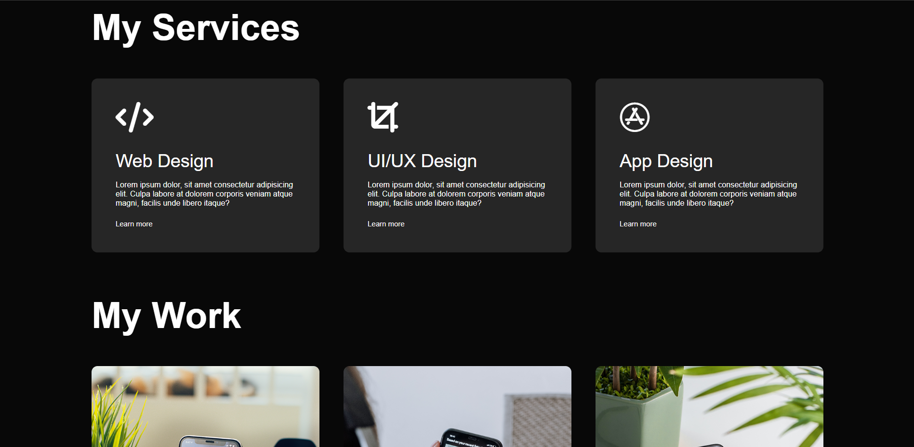
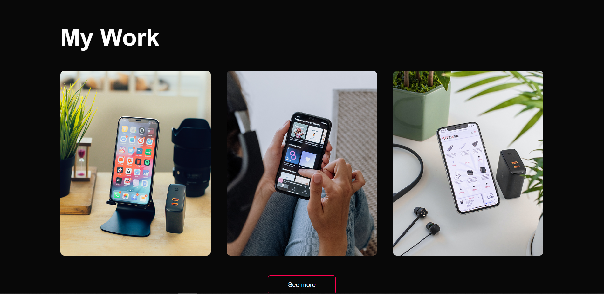

# Portfolio Website

This repository contains the source code for my personal portfolio website. The website is built using HTML, CSS, and JavaScript, with separate pages for Home, About, Services, Portfolio, and Contact sections.

## Sections

### Home
The home page serves as the landing page for the website. It provides a brief introduction and overview of the portfolio.

### About
The about page provides detailed information about myself, including my background, skills, and experience.

### Services
The services page outlines the various services I offer, such as web development, graphic design, etc.

### Portfolio
The portfolio page showcases some of my past projects, including descriptions and links to view more details.

### Contact
The contact page includes a form and contact information for visitors to reach out to me.

## Technologies Used
- HTML
- CSS
- JavaScript

## How to Run
To run the website locally, follow these steps:

1. Clone this repository to your local machine.
2. Navigate to the directory where you cloned the repository.
3. Open the `index.html` file in your web browser.

## Contributing
Contributions are welcome! If you find any issues or have suggestions for improvements, please feel free to open an issue or create a pull request.

## License
This project is licensed under the MIT License - see the [LICENSE](LICENSE) file for details.
